# 📘 Minna の Nihongo N5

**A Japanese N5 Learning App**  
_A beginner-friendly mobile app to master JLPT N5 vocabulary, grammar, kanji, and writing practice._

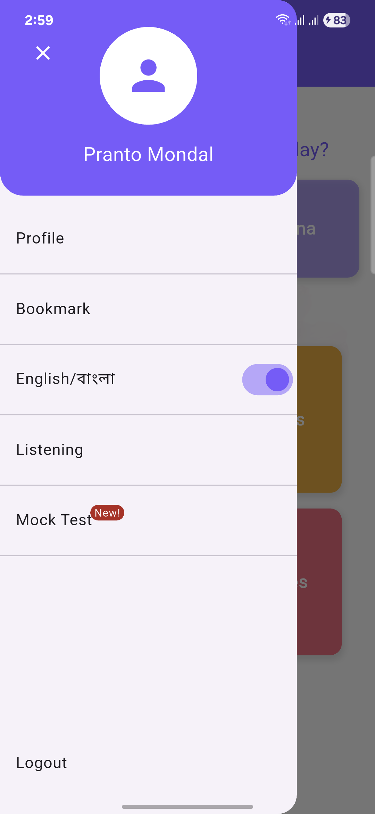

---

## 📱 Overview

**Minna の Nihongo N5** is designed for learners preparing for the **Japanese Language Proficiency Test (JLPT) N5 level**. The app covers all foundational areas including **Hiragana, Katakana, Vocabulary, Grammar, Particles, and Kanji**, offering a well-structured and interactive learning path. With engaging UI and quiz-based reinforcement, it helps users build a strong base in Japanese.

---

## 🚀 Features

- 🔤 **Hiragana & Katakana Practice** – Learn and trace Japanese characters with visual guidance
- 📘 **Grammar Lessons** – Understand sentence structure, particles, and basic grammar rules
- 🧠 **Vocabulary Builder** – Learn essential words with Romaji, audio, and example sentences
- 🀄 **Kanji Modules** – Stroke-by-stroke kanji training with meaning and pronunciation
- 🎯 **Interactive Quizzes** – Chapter-wise quizzes for self-assessment and reinforcement
- 📊 **Progress Tracking** – Monitor your chapter completion and quiz scores easily

---

## 🖼️ Screenshots

### 🏠 Home & Menu

| 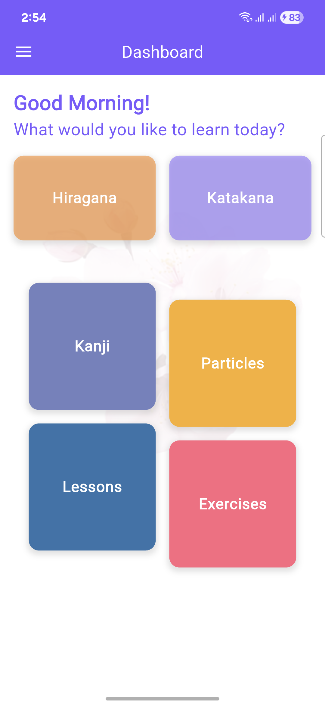 |  |

The home and menu screens provide easy navigation to all learning modules and track your study progress.

---

### ✍️ Hiragana & Katakana

| 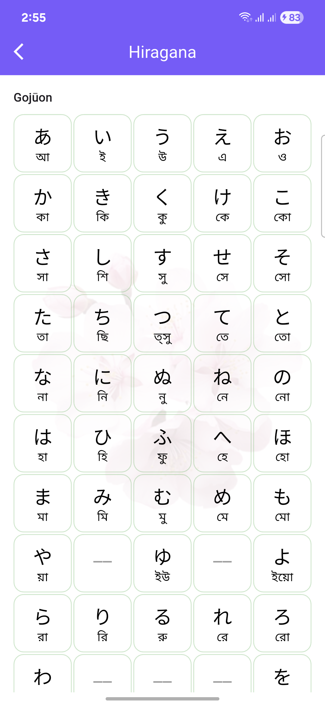 | 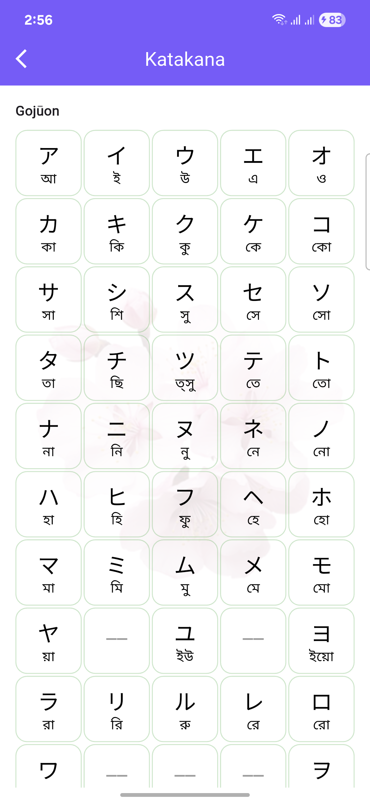 |

Master the Japanese writing system through guided stroke practice and flashcard-style review.

---

### 🈶 Kanji Learning

| 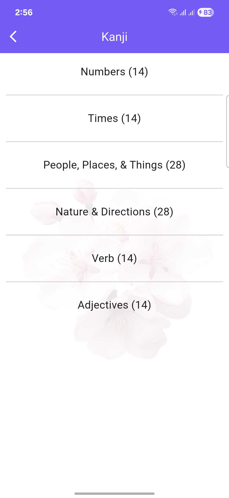 | 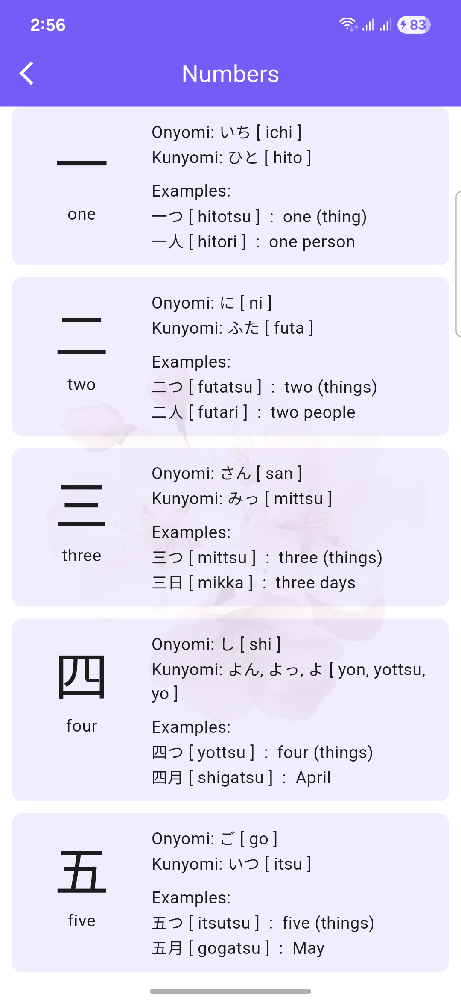 | 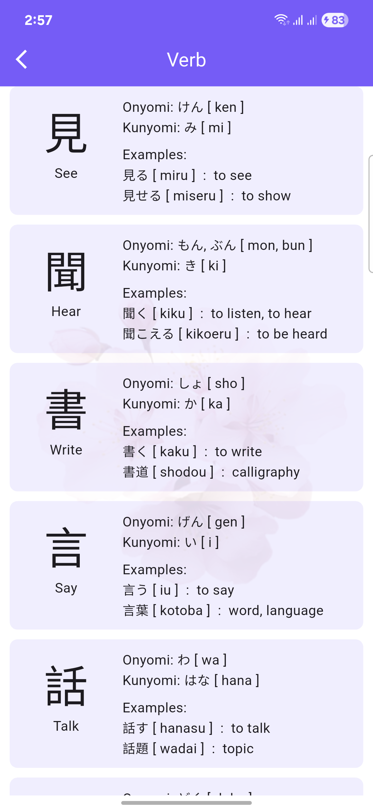 |

Learn JLPT N5-level kanji characters with stroke animations and example usage in context.

---

### 📘 Grammar & Particles

| 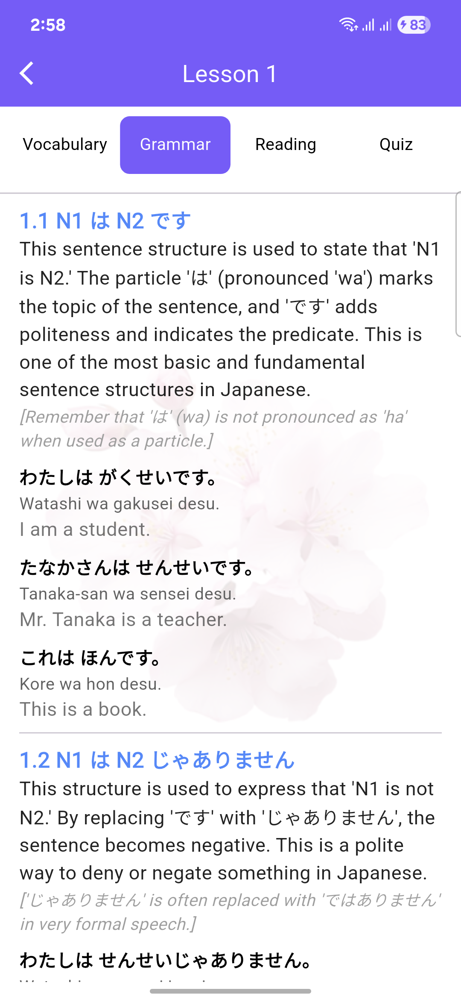 | 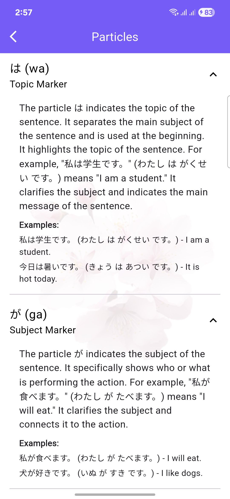 |

Grammar lessons include examples and breakdowns of sentence patterns, while the particles section explains their functions in context.

---

### 🧠 Lessons & Vocabulary

| 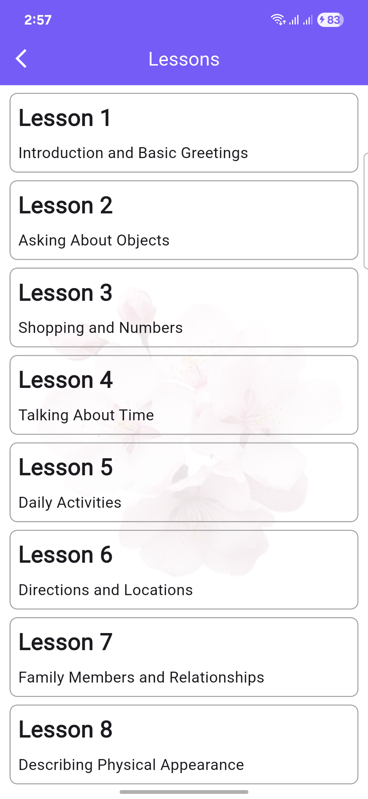 | 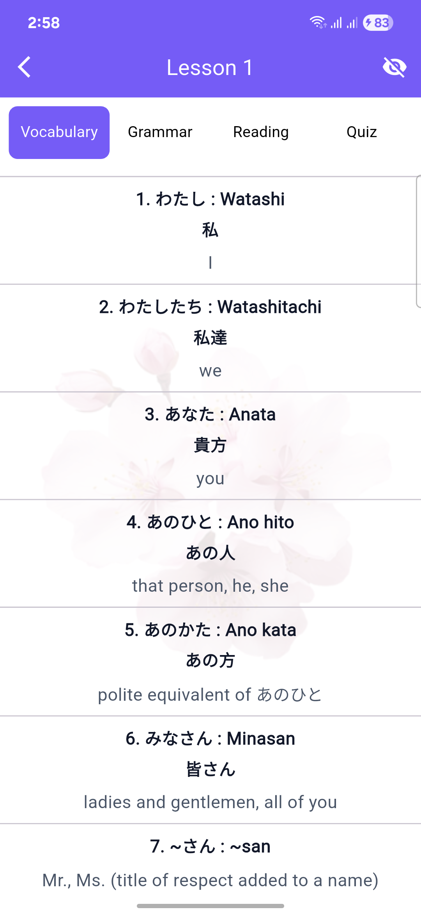 |

Each lesson is paired with curated vocabulary lists and practice sets, making learning structured and manageable.

---

### 📖 Quiz & More Vocabulary

| 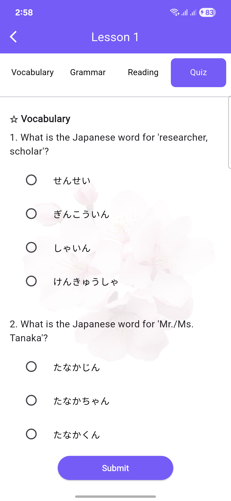 | 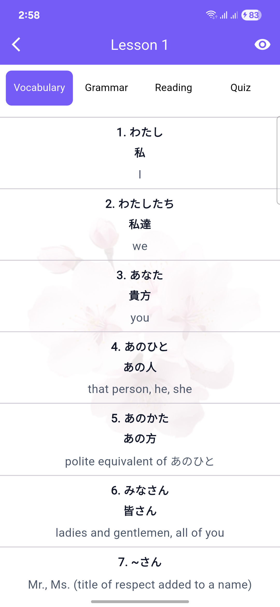 |

Reinforce your learning with chapter-based quizzes and track your accuracy and progress.

---

## 🛠️ Tech Stack

- **Flutter** – Used for building a smooth, cross-platform mobile experience on both Android and iOS
- **GetX** – For efficient state management, routing, and reactive UI updates
- **Hive** – Local data storage solution to save progress, scores, and offline access
- **Custom Widgets** – Designed for tracing, quiz interaction, and vocabulary rendering
- **Socket Integration (Planned)** – For future community quiz battles and leaderboards

---

## 👨‍💻 My Role

As the sole developer of **Minna の Nihongo N5**, I handled:

- 💡 UI/UX Design – Created intuitive navigation and learner-friendly visuals
- 🧩 Module Development – Built all screens including grammar, vocabulary, and writing practice
- 🔁 Logic Implementation – Managed state and quiz logic using GetX
- 🗃️ Local Storage – Used Hive to store user progress and offline data
- ✅ Testing – Conducted testing on various screen sizes and Android versions

---

## 📦 Project Status

✅ **Current Phase:** Feature-complete, under testing  
🚀 **Upcoming:** Launch on Google Play Store  
🎯 **Future Plans:** Add audio clips, spaced repetition, and multiplayer quiz battles

---

## 📬 Contact

📧 prantomondal517@gmail.com  
💼 [LinkedIn](https://www.linkedin.com/in/pranto-mondal-1a1307156/)  
📱 Available for freelance or collaborative Japanese learning tools!
